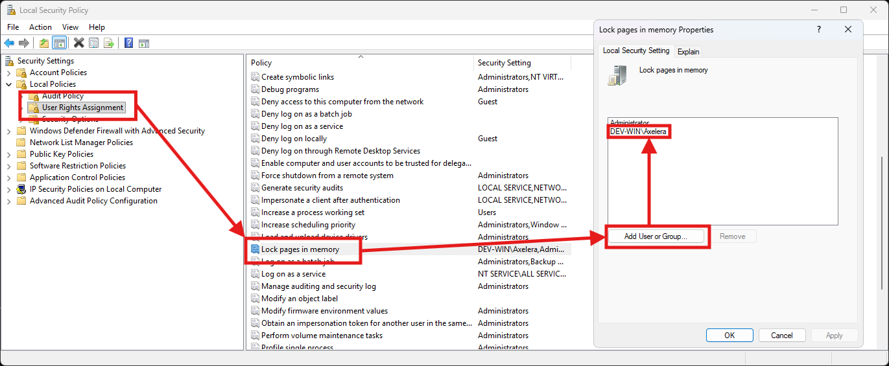
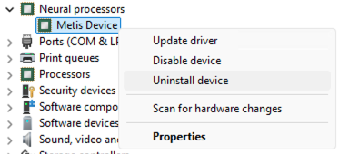
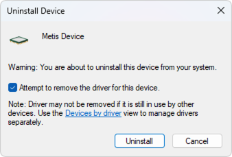
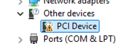
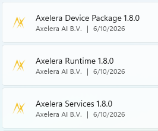

# Windows Setup

This guide covers installing the Axelera software on **Windows 11**. The main path is native Windows — you install the driver and Axelera components directly on Windows without WSL.

> [!IMPORTANT]
> **What works where**
>
> | Feature | Ubuntu (Linux) | Windows (Native) | Windows (WSL2) |
> |---------|---------------|------------------|----------------|
> | Network deployment | Yes | No | Yes |
> | Inference | Yes | AxRuntime API only | No |
>
> For model deployment, you need Linux or WSL2 — see [Step 2](#step-2-optional-install-wsl2-for-model-deployment) below.

---

## Step 1: Install the Windows driver

The Axelera Windows driver is not yet Microsoft-certified (certification is in progress). Until then, it requires manual install.

### 1a. Grant "Lock pages in memory" privilege

This step is required once per machine. The Axelera runtime needs the **Lock pages in memory** privilege to operate correctly.

1. Press **Win + S**, type `secpol.msc`, and press **Enter** to open the Local Security Policy editor
2. In the left pane, navigate to **Local Policies → User Rights Assignment**
3. In the right pane, double-click **Lock pages in memory**
4. Click **Add User or Group**, enter your Windows username, and confirm



Log out and back in (or reboot) for the privilege to take effect.

### 1b. Download the drivers

Download the driver archives from the Axelera software portal:

- **Metis driver** (required for all hardware): [MetisDriver-1.3.14.zip](https://software.axelera.ai/artifactory/axelera-win/driver/1.3.x/MetisDriver-1.3.14.zip)
- **Switchtec PCIe switch driver** (required only for the [Metis PCIe 4-AIPU card](https://store.axelera.ai/collections/ai-acceleration-cards/products/pcie-ai-accelerator-card-powered-by-4-metis-aipu)): [switchtec-kmdf-0.7_2019.zip](https://software.axelera.ai/artifactory/axelera-win/driver/1.3.x/switchtec-kmdf-0.7_2019.zip)

Extract each archive locally. Each extracted folder contains three files: `.cat`, `.inf`, and `.sys`.

### 1c. Remove any previous driver version

> [!TIP]
> **First-time install?** Skip this step and go straight to [1d](#1d-install-via-device-manager).

If you already have an older Metis driver installed, remove it completely before installing the new one. Windows can keep multiple drivers for the same device.

In Device Manager, locate the Metis device under **Neural Processors**, right-click and select **Uninstall device**:



In the confirmation dialog, check **"Attempt to remove the driver for this device"**, then click **Uninstall**:



Verify the device now appears under **Other devices** as a generic **PCI Device** — this confirms the driver is fully removed:



### 1d. Install via Device Manager

Open **Device Manager** (right-click the Windows Start button → Device Manager).

From the menu, open **Action → Add Drivers**:


Set the path to the folder where you extracted the Metis driver files:


Confirm that the Metis device now appears under **Neural Processors**:


**If you have a Metis PCIe 4-AIPU card**, repeat the same steps for the Switchtec driver:


---

## Step 2 (Optional): Install WSL2 for model deployment

> [!NOTE]
> **Skip this step if you only need inference.** If you want to deploy your own models or use the full SDK tooling, install WSL2 and follow the Linux setup inside it.

Network deployment is supported exclusively in Linux. WSL2 is the recommended approach for deploying models for Windows use.

### 2a. Install WSL2

Open **PowerShell as Administrator** and run:

```powershell
wsl --install -d Ubuntu-22.04
```

Restart your computer when prompted. After restart, Ubuntu opens and asks you to create a username and password.

> [!TIP]
> **Already have WSL?** Check your version: `wsl --list --verbose`. You need WSL **2** (not 1). Upgrade with `wsl --set-version Ubuntu-22.04 2`.

### 2b. Clone the SDK in a Windows-accessible folder

After the restart, open a regular **Command Prompt** (not PowerShell, not Administrator) and enter WSL:

```cmd
wsl
```

Inside WSL, clone to a path under `/mnt/c/` so both Windows and WSL can reach it:

```bash
# /mnt/c/ maps to C:\ on Windows
cd /mnt/c/Axelera
git clone https://github.com/axelera-ai-hub/voyager-sdk.git
cd voyager-sdk
```

This means:
- From **WSL**: `/mnt/c/Axelera/voyager-sdk`
- From **Windows**: `C:\Axelera\voyager-sdk`

### 2c. Follow the Linux setup inside WSL

Install the SDK inside WSL, then use it for model deployment:

1. [SDK Install](sdk-install.md) — clone, install, and activate
2. [deploy.py](../reference/tools/deploy-py.md) — compile and deploy models for use on Windows

> [!WARNING]
> When running `install.sh` inside WSL, **do not** select the driver installation option — the driver was installed on the Windows side in Step 1, not inside WSL.
>
> 

> [!NOTE]
> The Metis device is not accessible from inside WSL. Hardware verification and inference run on the Windows side (Steps 3–6 below).

---

## Step 3: Install Python (Windows native)

> [!NOTE]
> Perform this step in Windows natively, **not in WSL**.

1. Download [Python for Windows](https://www.python.org/downloads/windows/) from the official website. The latest stable release tested by Axelera is 3.13.5.

> [!IMPORTANT]
> Install Python from the official website link above — **not** from the Microsoft Store.

2. During installation:
   - Enable **"Add Python to PATH"**
   - Select **"Disable path length limit"** when prompted

3. Add the Python installation path and the `Python\Scripts` path to the Windows **Path** environment variable:

   

4. Create a virtual environment:

   ```cmd
   python -m venv venv-win
   ```

---

## Step 4: Install Windows Axelera components

> [!NOTE]
> Perform this step in Windows natively, **not in WSL**.

Open a regular **Command Prompt** (not PowerShell, not Administrator) and navigate to your SDK directory:

```cmd
cd C:\Axelera\voyager-sdk
```

Create a local download directory and download all packages:

```cmd
rmdir /s /q windows-packages 2>nul
mkdir windows-packages
cd windows-packages

curl -L -O https://software.axelera.ai/artifactory/axelera-win/packages/1.8.x/axelera-win-device-installer.exe
curl -L -O https://software.axelera.ai/artifactory/axelera-win/packages/1.8.x/axelera-win-runtime-installer.exe
curl -L -O https://software.axelera.ai/artifactory/axelera-win/packages/1.8.x/axelera-win-services-installer.exe

cd ..
```

### 4a. Install the executable packages

> [!IMPORTANT]
> If any previous Axelera packages are installed, uninstall them via **Apps & Features** before proceeding.

Using **Windows Explorer**, navigate to `C:\Axelera\voyager-sdk\windows-packages` and run each `.exe` installer in sequence.

After installation, verify via **Settings → Apps & features** (or **Add or remove programs**):


All three packages must be listed:



You must see: **Axelera Device Package**, **Axelera Runtime**, and **Axelera Services**. Exact version numbers will vary.

**Close all Command Prompt and PowerShell windows** after the installers complete, then open a new Command Prompt before continuing.

### 4b. Install Python packages

Activate the virtual environment and install the packages:

```cmd
venv-win\Scripts\activate.bat

pip install --extra-index-url https://software.axelera.ai/artifactory/api/pypi/axelera-pypi/simple axelera-runtime==1.8.0 axelera-llm==1.8.0 axelera-types==1.8.0
```

> [!TIP]
> **Re-activating the environment:** Remember to activate the virtual environment each time you open a new Command Prompt. From your SDK directory:
> ```cmd
> venv-win\Scripts\activate.bat
> ```
> You'll know it's active when `(venv-win)` appears at the start of your prompt.

---

## Step 5: Run examples

First, obtain a deployed model. If you completed the WSL2 setup in Step 2 and deployed a model there, it is accessible from Windows at `C:\Axelera\voyager-sdk\build\`. Otherwise, download a pre-built model:

```cmd
axdownloadmodel resnet50-imagenet-onnx
```

The model downloads to `C:\Axelera\voyager-sdk\build\`.

**Run inference using the `axrunmodel` utility** (measures performance):

```cmd
axrunmodel C:\Axelera\voyager-sdk\build\resnet50-imagenet-onnx\resnet50-imagenet-onnx\1\model.json
```

**Run inference using the Python API:**

Download an image to `C:\Axelera\voyager-sdk\examples\axruntime\images`, then:

```cmd
cd examples\axruntime
python -m axruntime_example -v --aipu-cores 1 --labels imagenet-labels.txt ..\..\build\resnet50-imagenet-onnx\resnet50-imagenet-onnx\1\model.json images
```

---

## Step 6: Run LLM models

A set of precompiled LLM models can run natively on Windows. To see available models:

```cmd
axllm --help-network
```

Run a model in single-prompt mode:

```cmd
axllm llama-3-2-1b-1024-4core-static --prompt "Give me a joke"
```

Run interactively in chat mode:

```cmd
axllm llama-3-2-1b-1024-4core-static
```

For all options, see the [LLM Inference Guide](llm.md).

---

## Using PowerShell

After completing installation, you can use PowerShell instead of Command Prompt. The only difference is how you activate the virtual environment:

```powershell
.\venv-win\Scripts\Activate.ps1
```

Once activated, all the same commands work as in Command Prompt.

> [!NOTE]
> **PowerShell execution policy**
> If you get an error activating the environment in PowerShell, your execution policy may be blocking unsigned scripts. Check your current policy:
> ```powershell
> Get-ExecutionPolicy
> ```
> If needed, set a more permissive policy (run PowerShell as Administrator):
> ```powershell
> Set-ExecutionPolicy RemoteSigned
> ```
>
> Use **Command Prompt** (not PowerShell) for the installation steps — particularly Step 4a. PowerShell is fine for running examples and day-to-day use after setup is complete.

---

## Troubleshooting

| Symptom | Fix |
|---------|-----|
| Metis not detected in Device Manager | Confirm the driver installed correctly — see [Step 1d](#1d-install-via-device-manager) |
| `wsl --install` fails | Enable "Virtual Machine Platform" in Windows Features |
| WSL shows version 1 | `wsl --set-version Ubuntu-22.04 2` |
| PowerShell can't activate venv | Run `Set-ExecutionPolicy RemoteSigned` as Administrator, then retry |
| Installer fails silently | Uninstall all previous Axelera packages first via Apps & Features |

---

## See also

- [SDK Install](sdk-install.md) — the main Linux/WSL installation guide
- [Verify Setup](../getting-started/verify-setup.md) — confirm hardware and SDK are working
- [LLM Inference Guide](llm.md) — full LLM options including Windows
